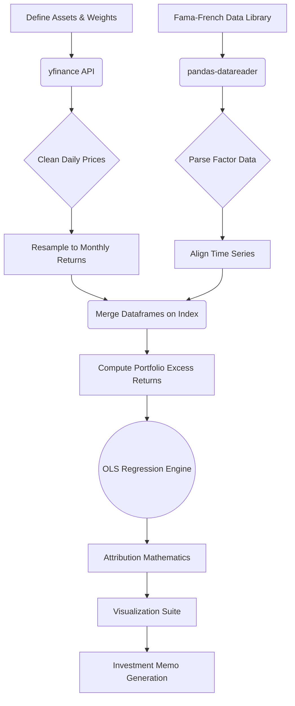

# Factor Zoo: Multi-Factor Portfolio Attribution

> I built this to answer a simple question: when a portfolio makes money, *why* did it make money? Was it skill, market exposure, or just being in the right factors at the right time?

---

## Table of Contents

- [Motivation](#motivation)
- [Project Features](#project-features)
- [Repository Structure](#repository-structure)
- [Finance Background](#finance-background)
- [CAPM (Capital Asset Pricing Model)](#capm-capital-asset-pricing-model)
- [Fama-French 3-Factor Model](#fama-french-3-factor-model)
- [Fama-French 5-Factor Model](#fama-french-5-factor-model)
- [Momentum (Carhart 4-Factor)](#momentum-carhart-4-factor)
- [Fama-French 6-Factor Model](#fama-french-6-factor-model)
- [Data Pipeline](#data-pipeline)
- [Project Architecture](#project-architecture)
- [Statistical Methodology](#statistical-methodology)
- [Code Walkthrough](#code-walkthrough)
- [Visualizations](#visualizations)
- [Example Interpretation](#example-interpretation)
- [Limitations](#limitations)
---

## Motivation

I started reading about factor investing and kept seeing the same claim: "most fund managers don't actually beat the market — they just take on more risk." That sounded like something I could test, so I decided to build a tool that actually checks.

A 15% annual return sounds impressive until you find out the market returned 20% over the same period. Or worse — that the 15% came from taking on way more volatility than necessary. I wanted to go beyond surface-level performance numbers and understand what's really going on under the hood.

My goal was to implement the Fama-French factor models myself instead of just reading about them in textbooks. By regressing a portfolio's excess returns against known risk factors, I can separate real skill (alpha) from standard market exposure (beta). This isn't meant to compete with professional analytics tools — I built it because I genuinely wanted to understand how quantitative researchers think about returns.

---

## Project Features

- **Data Ingestion**: Pulls historical prices from Yahoo Finance and factor returns from the Kenneth R. French Data Library.
- **Portfolio Construction**: Builds custom-weighted portfolios from user-defined ticker lists.
- **Factor Regressions**: Runs CAPM, FF3, FF5, and FF6 regressions to see how alpha changes as more factors are added.
- **Statistical Output**: Uses OLS regression to estimate betas, $R^2$, p-values, and standard errors.
- **Rolling Regressions**: Tracks how factor exposures shift over time to detect style drift.
- **Return Attribution**: Breaks down total returns into percentage contributions from Market, Size, Value, Profitability, Investment, and Momentum.
- **Visualizations**: Generates factor loading charts, attribution waterfalls, and rolling beta plots.
- **Summary Reports**: Automatically writes a plain-English investment memo from the regression results.

---

## Repository Structure

```text
Factor-Zoo-Attribution/
│
├── factor_zoo.py               # Main script — all data, regressions, and charts
├── requirements.txt            # Python dependencies
├── README.md                   # Project documentation
│
├── output/                     # Generated charts and reports
│   ├── 1_factor_loadings.png
│   ├── 2_attribution_waterfall.png
│   ├── 3_rolling_betas.png
│   ├── 4_equity_curves.png
│   ├── 5_factor_correlation.png
│   └── investment_memo.txt
│
└── data/                       # Cached data (git-ignored)
    ├── portfolio_prices.csv
    └── fama_french_factors.csv
```

---

## Finance Background

Before diving into the code, here's the finance you need to know. I had to learn all of this while building the project, so I'm going to explain it the way I wish someone had explained it to me.

### What is Risk?
In finance, risk isn't just "you might lose money." It's uncertainty — when you buy a stock, you're not guaranteed any specific outcome. You're essentially buying a probability distribution of future returns. That framing clicked for me when I realized it's why two assets with the same average return can have completely different risk profiles.

### Systematic vs. Unsystematic Risk
1. **Unsystematic Risk**: Risk specific to one company — a CEO resigns, a drug trial fails. You can basically eliminate this by owning enough different stocks (diversification).
2. **Systematic Risk**: Economy-wide risk that hits everything — interest rate hikes, recessions, inflation. No amount of diversification removes this. This is the risk that factor models care about.

### Why Factor Models?
Here's the key insight that made factor models click for me: instead of trying to explain why 500 individual stocks move, you can explain most of their behavior with just a handful of underlying forces. The code in `factor_zoo.py` uses OLS regression to measure exactly how exposed a portfolio is to each of those forces (its betas).

---

## CAPM (Capital Asset Pricing Model)

CAPM (Sharpe, Lintner, Mossin — 1960s) is the simplest factor model: it says there's only one source of systematic risk, the overall market. I started here because it's the foundation everything else builds on.

- **Market Beta ($\beta$)**: How much the portfolio moves when the market moves. Beta of 1.0 = moves exactly with the market. Beta of 1.5 = 50% more volatile than the market.
- **Alpha ($\alpha$)**: Whatever return is left over after you account for market exposure. This is the "did the manager actually add value?" number. In a perfectly efficient market, alpha should be zero.

### Formula
$$ E(R_i) - R_f = \alpha + \beta_i [E(R_m) - R_f] + \epsilon_i $$

**In the code**: I subtract the risk-free rate from the portfolio's return and regress it against the Market Excess Return (`Mkt-RF`) from the Fama-French database. Simple, but limited — which is why the later models add more factors.

---

## Fama-French 3-Factor Model

CAPM left a lot unexplained. Fama and French (1993) found two patterns it completely missed:

1. **SMB (Small Minus Big)**: Small-cap stocks have historically beaten large-caps. The intuition is that smaller companies are riskier and less liquid, so investors demand a premium for holding them.
2. **HML (High Minus Low)**: Value stocks (cheap relative to book value) have historically outperformed growth stocks. This was one of the first "anomalies" that challenged the idea of a single-factor world.

**In the code**: I add `SMB` and `HML` as extra independent variables in the regression. This is important because without them, a portfolio that simply overweights small-cap value stocks would show fake alpha — the model would credit the manager for returns that were really just factor exposure.

---

## Fama-French 5-Factor Model

In 2015, Fama and French realized even three factors weren't enough and added two based on company fundamentals:

1. **RMW (Robust Minus Weak)**: Companies with strong operating profitability earn higher returns. This one makes intuitive sense — profitable companies *should* be worth more.
2. **CMA (Conservative Minus Aggressive)**: Companies that don't spend aggressively on expansion have historically outperformed those that do. I found this one counterintuitive at first — you'd think growth spending would be rewarded, but the data says otherwise.

**In the code**: I merge `RMW` and `CMA` into the dataset. When the regression runs, it can now isolate how much of the portfolio's return came purely from holding profitable, conservatively-investing companies — and how much was something else.

---

## Momentum (Carhart 4-Factor)

This one is probably the most interesting to me. Carhart (1997) showed that stocks which went up over the past 3–12 months tend to *keep* going up, and stocks that went down tend to keep falling. It's basically trend-following, and it seems to work because of behavioral biases — investors are slow to react to new information, or they sell winners too early and hold onto losers hoping they'll recover.

**In the code**: I download the `F-F_Momentum_Factor` dataset and align it with the other factors. Adding momentum to the model often explains a chunk of return that the other five factors miss.

---

## Fama-French 6-Factor Model

This is the final boss: Market + Size + Value + Profitability + Investment + Momentum, all in one regression. It controls for basically every well-documented systematic return pattern in academic finance.

The way I think about it: if a portfolio *still* shows significant positive alpha after you've accounted for all six of these factors, that's a pretty strong signal that something genuinely skillful is going on (or there's a risk the model doesn't capture). The script runs this as the last and most demanding test, and uses the output to generate the final investment memo and attribution waterfall.

---

## Data Pipeline

Honestly, I spent more time on data cleaning than on the actual regressions. Getting Yahoo Finance data and Fama-French data to play nicely together was trickier than I expected — different date formats, different frequencies, missing months. This is the part of the project that taught me the most about real-world data work.



### Pipeline Stages
1. **Downloading Prices**: `yfinance` fetches adjusted closing prices, which already account for dividends and stock splits — so I don't have to manually adjust for those.
2. **Calculating Returns**: Daily prices are resampled to month-end (`resample('M').last()`) and converted to percentage changes. I had to do this because Fama-French data is monthly, so my portfolio data needs to match.
3. **Fetching Factors**: `pandas-datareader` pulls the latest factor datasets directly from the Dartmouth servers — no manual CSV downloads needed.
4. **Data Alignment**: This is where I use an inner join on dates. If a month of factor data hasn't been published yet but I have Yahoo Finance data for it, the join drops that month. This prevents `NaN` errors and avoids look-ahead bias (using data you wouldn't have had in real time).

---

## Project Architecture

```text
+-------------------------------------------------------------+
|                     User Configuration                      |
| (Tickers, Weights, Risk-Free Rate, Lookback Window)         |
+-------------------------------------------------------------+
                              |
                              v
+-------------------------------------------------------------+
|                   Data Ingestion Module                     |
|  [yfinance] <---> [pandas] <---> [pandas-datareader]        |
+-------------------------------------------------------------+
                              |
                              v
+-------------------------------------------------------------+
|                    Regression Engine                        |
|  + CAPM Estimator                                           |
|  + FF3 Estimator           [StatsModels API]                |
|  + FF5 Estimator                                            |
|  + FF6 Estimator                                            |
+-------------------------------------------------------------+
                              |
                              v
+-----------------------------+-------------------------------+
|         Analytics           |           Reporting           |
| + Return Attribution        | + Matplotlib Visualizations   |
| + Rolling Regressions       | + Text-based Investment Memo  |
| + Statistical Significance  | + Metric Calculations         |
+-----------------------------+-------------------------------+
```

---

## Statistical Methodology

This section covers the stats behind the regressions. I had to learn most of this as I went, so I'll explain it the way that made sense to me.

### OLS Regression
Ordinary Least Squares is the workhorse here. It finds the line (or hyperplane, when there are multiple factors) that minimizes the sum of squared errors between predicted and actual values. The dependent variable is the portfolio's excess return; the independent variables are the risk factors. It's conceptually simple, but surprisingly powerful.

### Key Metrics
- **$R^2$**: How much of the portfolio's variance the factors explain. $R^2$ of 0.85 means 85% of the return variation is captured by the model — the remaining 15% is stock-specific noise.
- **Adjusted $R^2$**: Same idea, but it penalizes you for adding useless variables. I check this to make sure that going from FF3 to FF5 actually improved the model and didn't just overfit.
- **p-values**: The probability of seeing a beta this large if the true beta were actually zero. Below 0.05 = statistically significant. This is how I decide if a factor exposure is real or just noise.
- **t-statistics**: The coefficient divided by its standard error. Bigger absolute values = more confidence. This is what generates the p-value.
- **Alpha Significance**: A positive alpha sounds great, but it only counts if its p-value is significant. Otherwise, you might just be looking at random variation.

**Why `statsmodels` over `scikit-learn`?** This was a deliberate choice. `scikit-learn`'s `LinearRegression` gives you coefficients and $R^2$, but it doesn't give you t-stats, p-values, confidence intervals, or standard errors. For financial analysis, those are the numbers that actually matter — they tell you whether your results are statistically meaningful or just noise.

---

## Code Walkthrough

Here's how `factor_zoo.py` is organized. I tried to keep things modular so I could swap in different portfolios without touching the core logic.

- **Portfolio Construction**: Tickers and weights live at the top of the file — easy to change. The script takes the dot product of weights and asset returns to get a single portfolio return series.
- **Downloading Prices**: `yfinance` pulls adjusted closing prices (already adjusted for dividends and splits, which tripped me up at first when I was getting weird return numbers).
- **Calculating Returns**: Daily prices are resampled to month-end and converted to percentage changes to match the monthly Fama-French data.
- **Downloading Factor Data**: `pandas-datareader` fetches the latest factors from the Dartmouth servers automatically, so I don't have to manually download CSVs every time I run the script.
- **Aligning Datasets**: Inner join on date indices. This drops mismatched dates and prevents the `NaN` errors that kept breaking my early versions.
- **Regression**: The script loops through CAPM, FF3, FF5, and FF6. One thing that confused me initially: I have to use `sm.add_constant(X)` to add an intercept column, otherwise the regression forces alpha to zero — which would make it literally impossible to detect outperformance.
- **Attribution**: Each factor's contribution = its beta × the factor's annualized mean return. Simple multiplication, but it tells you exactly where the portfolio's returns came from.
- **Rolling Regression**: A 36-month rolling window refits the model at each step to track how betas shift over time. This is how you catch style drift.
- **Plotting**: `matplotlib` generates five charts. I spent a lot of time getting these to look clean and readable.
- **Memo Generation**: The script parses the FF6 results and writes a plain-English summary. I added this because raw regression tables are hard to read if you're not staring at them every day.

---

<details>
<summary>Click here to expand the detailed Visualizations breakdown</summary>

## Visualizations

I generate five charts because staring at regression tables only gets you so far. These make the results much easier to actually interpret.

### 1. Factor Loadings (`1_factor_loadings.png`)
- **What it shows**: A grouped bar chart of betas across all four models (CAPM, FF3, FF5, FF6).
- **Why it matters**: You can see how factor weights shift as the model gets more complex. A high CAPM market beta might actually be masking a heavy size or value exposure.
- **How to read it**: Bars above zero = positive tilt (e.g., long value, long small-cap). Bars below zero = negative tilt (e.g., growth tilt, large-cap tilt).
- **Common mistake**: A negative HML beta doesn't mean the portfolio is shorting value stocks — it just means the portfolio underweights value relative to the market.

### 2. Attribution Waterfall (`2_attribution_waterfall.png`)
- **What it shows**: A waterfall chart breaking down the total annualized return into factor contributions.
- **Why it matters**: It answers "why did this portfolio make money?" If 90% came from the market factor, the manager mostly just rode a bull market.
- **Common mistake**: A high historical alpha doesn't guarantee future outperformance. It could be luck or an unmeasured risk.

### 3. Rolling Betas (`3_rolling_betas.png`)
- **What it shows**: 36-month rolling betas for each factor over time.
- **Why it matters**: Static regressions assume exposures never change. This chart reveals style drift — for example, a portfolio slowly shifting from value to growth.
- **Common mistake**: Don't overreact to short-term spikes. A single weird month can cause a beta spike that's just noise.

### 4. Equity Curves (`4_equity_curves.png`)
- **What it shows**: Cumulative growth of $1 invested in the portfolio vs. the market benchmark.
- **Why it matters**: A quick visual check of absolute performance and drawdowns.
- **Common mistake**: A steeper equity curve might just mean more risk, not more skill — which is exactly why we need factor models to contextualize it.

### 5. Factor Correlation Matrix (`5_factor_correlation.png`)
- **What it shows**: A heatmap of Pearson correlations between the factors.
- **Why it matters**: If two factors are highly correlated (> 0.8), the regression may struggle to separate their individual effects, widening the standard errors (multicollinearity).
- **Common mistake**: Factors that appear uncorrelated over the full period can suddenly become highly correlated during a crisis.

</details>

---

## Example Interpretation

> **Hypothetical Output Analysis**

To show what the output actually looks like, here's how I'd read a hypothetical FF6 result:

- **Market Beta = 1.02**: Moves almost exactly with the market — no real leverage or hedging.
- **SMB = -0.35**: Negative means it leans toward large-cap stocks (not small-caps).
- **HML = -0.42**: Negative means growth tilt, not value.
- **RMW = 0.28**: Favors profitable companies — makes sense for a quality-oriented portfolio.
- **Momentum = 0.10**: Slight positive momentum tilt, but not a huge factor here.
- **Alpha = +2.0% (p-value = 0.03)**: 200 basis points of excess return per year that the six factors can't explain. Since p < 0.05, this is statistically significant — probably skill or an unmeasured risk, not just luck.
- **$R^2$ = 0.87**: The model explains 87% of the portfolio's return variance. Only 13% is stock-specific noise.

**My read**: This is basically a large-cap growth portfolio that leans toward quality companies and generated statistically significant alpha during the period. Whether that alpha persists going forward is a different question.

---

## Limitations

I want to be upfront about what this project doesn't do well:

- **Survivorship Bias**: I'm only looking at stocks that exist today. Companies that went bankrupt or were delisted don't appear in the data, which makes historical returns look better than they actually were.
- **Monthly Frequency**: Monthly data smooths out a lot. Short-lived factor exposures within a month get completely missed.
- **Static Weights**: The portfolio weights never rebalance, which isn't how real portfolios work. In practice, you'd rebalance periodically.
- **Factor Timing**: The model assumes factor premia are constant over the whole period. In reality, value or momentum can underperform for *years* at a time.
- **No Transaction Costs**: Real portfolios pay for trading, taxes, and slippage. This analysis ignores all of that.
- **Look-Ahead Bias Risk**: Using the full sample period for a single regression implicitly uses future data to estimate past exposures. The inner join helps avoid the worst cases, but it's not a perfect solution.

These are all things I'd want to address if I keep building on this project.
