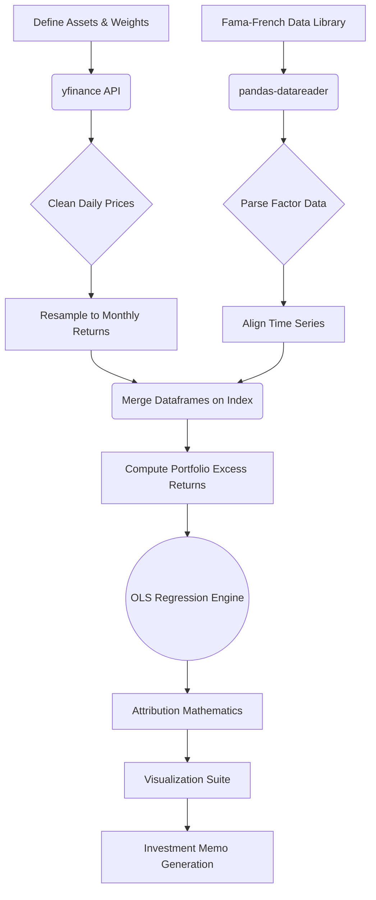

# Factor Zoo: Multi-Factor Portfolio Attribution

> A Python implementation of multi-factor portfolio attribution to understand what drives returns.

---

## Table of Contents

- [Motivation](#motivation)
- [Project Features](#project-features)
- [Repository Structure](#repository-structure)
- [Finance Background](#finance-background)
- [CAPM (Capital Asset Pricing Model)](#capm-capital-asset-pricing-model)
- [Fama-French 3-Factor Model](#fama-french-3-factor-model)
- [Fama-French 5-Factor Model](#fama-french-5-factor-model)
- [Momentum (Carhart 4-Factor)](#momentum-carhart-4-factor)
- [Fama-French 6-Factor Model](#fama-french-6-factor-model)
- [Data Pipeline](#data-pipeline)
- [Project Architecture](#project-architecture)
- [Statistical Methodology](#statistical-methodology)
- [Code Walkthrough](#code-walkthrough)
- [Visualizations](#visualizations)
- [Example Interpretation](#example-interpretation)
- [Limitations](#limitations)
---

## Motivation

I built this project to better understand why portfolios earn the returns they do. Looking at raw performance, like a 15% annual return, isn't enough. If the broader equity market returned 20% over the same period, that 15% is actually an underperformance. Even worse, if that 15% came from taking on massive and uncompensated volatility, the risk-adjusted performance is poor. 

While learning about factor investing, I wanted to implement the Fama-French models myself instead of only reading about them. One goal of this project was to connect the financial theory I was learning with actual Python code.

By running regressions on a portfolio's excess returns against macroeconomic risk factors, we can separate true outperformance (Alpha) from standard market exposure (Beta). Although this project isn't meant to compete with institutional portfolio analytics platforms, it demonstrates many of the same core ideas used by quantitative researchers to evaluate strategies.

---

## Project Features

- **Data Ingestion**: Pulls historical asset prices from Yahoo Finance and factor returns from the Kenneth R. French Data Library.
- **Portfolio Construction**: Builds custom-weighted portfolios from user-defined ticker lists.
- **Econometric Modeling**: Runs CAPM, FF3, FF5, and FF6 regressions to see how Alpha changes as more explanatory variables are added.
- **Statistical Estimation**: Uses Ordinary Least Squares (OLS) regression to estimate Betas, $R^2$, and robust standard errors.
- **Rolling Regressions**: Analyzes dynamic factor exposures over time to detect style drift.
- **Return Attribution**: Decomposes total returns into specific percentage contributions from Market, Size, Value, Profitability, Investment, and Momentum factors.
- **Visualizations**: Generates factor loading charts, attribution waterfalls, and rolling beta trajectories.
- **Summary Reports**: Automatically generates a plain-English text summary of the regression outputs.

---

## Repository Structure

```text
Factor-Zoo-Attribution/
│
├── factor_zoo.py               # Core application and quantitative engine
├── requirements.txt            # Python dependency specifications
├── README.md                   # Comprehensive project documentation
│
├── output/                     # Generated analytics artifacts
│   ├── 1_factor_loadings.png
│   ├── 2_attribution_waterfall.png
│   ├── 3_rolling_betas.png
│   ├── 4_equity_curves.png
│   ├── 5_factor_correlation.png
│   └── investment_memo.txt
│
└── data/                       # Cached data directories (git-ignored)
    ├── portfolio_prices.csv
    └── fama_french_factors.csv
```

---

## Finance Background

To understand what the code is doing, it helps to outline the underlying finance concepts.

### What is Risk?
In finance, risk is fundamentally defined as variance or uncertainty. When buying an asset, you are not guaranteed a specific outcome; you are purchasing a probability distribution of future returns. 

### Systematic vs. Unsystematic Risk
1. **Unsystematic Risk (Idiosyncratic Risk)**: Risk specific to an individual company (e.g., a CEO resigning or a drug trial failing). This risk can be virtually eliminated through diversification.
2. **Systematic Risk (Market Risk)**: Macroeconomic risk that affects all companies simultaneously (e.g., interest rate changes or inflation). It cannot be diversified away.

### Why do Investors Demand Compensation for Risk?
Rational investors are risk-averse. To entice them to take on systematic risk, the market must offer an expected return higher than a risk-free asset like a U.S. Treasury Bill.

### How do Factor Models Work?
A factor model attempts to explain an asset's return based on its exposure to systematic risks (factors). Instead of analyzing 500 individual stocks, these models suggest that returns are driven by a few underlying forces.

**How this project implements it**: The core of `factor_zoo.py` is an OLS regression engine that takes the time-series of a portfolio's returns and regresses it against the time-series of these systematic risk factors to calculate exact numerical exposures (Betas).

---

## CAPM (Capital Asset Pricing Model)

The Capital Asset Pricing Model, developed by William Sharpe, John Lintner, and Jan Mossin in the 1960s, was the first formal asset pricing model.

### Intuition
CAPM suggests there is only one source of systematic risk: the broader market.
- **Market Beta ($\beta$)**: An asset's sensitivity to market movements. A beta of 1.0 means it moves with the market.
- **Alpha ($\alpha$)**: The residual return unexplained by market exposure. In an efficient market, true alpha should be zero. Positive alpha indicates superior skill (or luck).

### Mathematics
$$ E(R_i) - R_f = \alpha + \beta_i [E(R_m) - R_f] + \epsilon_i $$

**How this project implements it**: The script calculates the portfolio's return minus the risk-free rate ($R_f$) and regresses it solely against the Market Excess Return (`Mkt-RF`) column downloaded from the Fama-French database.

---

## Fama-French 3-Factor Model

Eugene Fama and Kenneth French introduced two additional factors in 1993 after observing that CAPM failed to explain certain anomalies.

### Intuition
1. **SMB (Small Minus Big)**: The Size factor. Small-cap stocks historically outperform large-cap stocks because they are less liquid and inherently riskier.
2. **HML (High Minus Low)**: The Value factor. Value stocks (high book-to-market ratio) historically require a premium to attract investors compared to Growth stocks (low book-to-market).

**How this project implements it**: The code adds the `SMB` and `HML` columns as independent variables in the multiple regression. This prevents the model from assigning false Alpha to a portfolio that simply over-weights small-cap value stocks.

---

## Fama-French 5-Factor Model

In 2015, Fama and French added two corporate fundamental factors to their model.

### Intuition
1. **RMW (Robust Minus Weak)**: The Profitability factor. Companies with robust operating profitability tend to yield higher returns than weak ones.
2. **CMA (Conservative Minus Aggressive)**: The Investment factor. Companies that invest conservatively (low capital expenditure) historically provide a systematic premium over aggressive spenders.

**How this project implements it**: The script merges the `RMW` and `CMA` columns into the dataset. When the regression runs, it isolates how much of the portfolio's return was purely due to holding highly profitable, conservatively investing companies.

---

## Momentum (Carhart 4-Factor)

Mark Carhart (1997) documented that asset prices display time-series persistence.

### Intuition
Momentum is the observation that stocks which performed well over the past 3 to 12 months tend to continue performing well, while past losers continue to lose. It is often explained by behavioral biases like investor underreaction to news or the disposition effect (selling winners too early to lock in gains and holding losers too long).

**How this project implements it**: The script downloads the `F-F_Momentum_Factor` dataset and aligns it with the standard factor data to capture the Momentum (`MOM` or `UMD` — Up Minus Down) premium.

---

## Fama-French 6-Factor Model

This model integrates the 5-Factor model with the Momentum factor.

### Why Six Factors?
By regressing against Market, Size, Value, Profitability, Investment, and Momentum, we account for almost all well-documented systematic anomalies. If a portfolio manager still shows a statistically significant positive Alpha in this 6-Factor model, it strongly suggests genuine stock-picking skill or an unmeasured risk exposure, rather than passive factor harvesting.

**How this project implements it**: The script runs this as the final and most rigorous test in the suite, using the output to generate the final investment memo and attribution waterfall.

---

## Data Pipeline

Building a clean data pipeline to handle time-series alignment was one of the most important parts of this project. Financial data from different sources is rarely perfectly synchronized.



### Pipeline Stages
1. **Downloading Prices**: I use `yfinance` to get adjusted closing prices, which automatically account for dividends and stock splits.
2. **Calculating Returns**: The daily prices are resampled to end-of-month prices (`resample('M').last()`), and percentage changes are computed. This is necessary because Fama-French factor data is distributed monthly.
3. **Fetching Factors**: The `pandas-datareader` library dynamically downloads the latest factor datasets directly from the Dartmouth servers.
4. **Data Alignment**: This is a critical step. The script uses an inner join on the date indices. If a month of factor data hasn't been published yet, but we have Yahoo Finance data for that month, the inner join drops it. This prevents `NaN` errors and ensures look-ahead bias is avoided.

---

## Project Architecture

```text
+-------------------------------------------------------------+
|                     User Configuration                      |
| (Tickers, Weights, Risk-Free Rate, Lookback Window)         |
+-------------------------------------------------------------+
                              |
                              v
+-------------------------------------------------------------+
|                   Data Ingestion Module                     |
|  [yfinance] <---> [pandas] <---> [pandas-datareader]        |
+-------------------------------------------------------------+
                              |
                              v
+-------------------------------------------------------------+
|                 Econometric Modeling Core                   |
|  + CAPM Estimator                                           |
|  + FF3 Estimator           [StatsModels API]                |
|  + FF5 Estimator                                            |
|  + FF6 Estimator                                            |
+-------------------------------------------------------------+
                              |
                              v
+-----------------------------+-------------------------------+
|         Analytics           |           Reporting           |
| + Return Attribution        | + Matplotlib Visualizations   |
| + Rolling Regressions       | + Text-based Investment Memo  |
| + Statistical Significance  | + Metric Calculations         |
+-----------------------------+-------------------------------+
```

---

## Statistical Methodology

To interpret the outputs, it helps to understand the underlying econometrics.

### OLS Regression
Ordinary Least Squares minimizes the sum of squared residuals to estimate the relationship between the factors (independent variables) and the portfolio's excess return (dependent variable).

### Key Metrics
- **$R^2$**: The percentage of the portfolio's variance explained by the factors. An $R^2$ of 0.85 means 85% of the volatility is driven by the model's factors.
- **Adjusted $R^2$**: Penalizes the model for adding useless variables. I use this to check if moving from the 3-factor to 5-factor model actually improved explanatory power.
- **p-values**: The probability of observing the estimated Beta if the true Beta was zero. A p-value < 0.05 indicates statistical significance.
- **t-statistics**: Calculated as the coefficient divided by its standard error. Used to determine the p-value.
- **Alpha Significance**: The intercept of the regression. A positive alpha is only meaningful if its p-value is significant; otherwise, it's likely just statistical noise.

**How this project implements it**: I chose `statsmodels.api.OLS` over `scikit-learn` because `statsmodels` provides a comprehensive econometric summary out-of-the-box, allowing easy extraction of t-stats, p-values, and standard errors, which are crucial for financial analysis.

---

## Code Walkthrough

I structured `factor_zoo.py` logically to separate configuration, data processing, and visualization.

- **Portfolio Construction**: The user defines a dictionary of tickers and weights at the top of the file. This makes it easy to test different portfolios without changing the core code. The script takes these weights and computes the dot product against the asset returns to generate a single time-series of aggregate portfolio returns.
- **Downloading Prices**: The script uses `yfinance` to download adjusted closing prices for the defined tickers. Adjusted prices are necessary because they automatically account for dividends and stock splits, reflecting the true return.
- **Calculating Returns**: Daily prices are resampled to end-of-month prices (`df.resample('M').last()`), and percentage changes are computed. I did this because the Fama-French factor data is published monthly, so our portfolio data must match that frequency exactly.
- **Downloading Factor Data**: The `pandas-datareader` library fetches the latest Fama-French factors directly from the Dartmouth servers. This ensures the model is always using the most up-to-date academic datasets without needing manual CSV downloads.
- **Aligning Datasets**: Financial time-series data is notoriously messy. I used an inner join on the date indices between the portfolio returns and the factor data. This drops any mismatched dates, preventing `NaN` errors and avoiding look-ahead bias.
- **Regression**: The script iterates through the CAPM, FF3, FF5, and FF6 models. I use `sm.add_constant(X)` to append an intercept to the independent variables. Without this constant, the regression would force the intercept to zero, making it mathematically impossible to estimate Alpha.
- **Attribution**: To figure out how much a factor contributed to the total portfolio return, the script multiplies the calculated Beta for that factor by the annualized mean return of the factor over the analyzed time period.
- **Rolling Regression**: Static regressions assume factor exposures never change. To capture "style drift" (e.g., a manager slowly moving from Value to Growth), the script loops through the time-series with a 36-month window, refitting the OLS model at each step to track dynamic Betas.
- **Plotting**: The visualization functions use `matplotlib` to generate charts. They iterate through the regression results to pull out Betas, $R^2$ values, and rolling metrics, styling them into clean, readable PNGs.
- **Memo Generation**: Finally, the script parses the FF6 results dictionary and uses string formatting to write a plain-English text document explaining the statistical conclusions. This makes the output accessible to someone who might not want to read raw regression tables.

---

<details>
<summary>Click here to expand the detailed Visualizations breakdown</summary>

## Visualizations

Data visualization is essential for communicating complex econometric data. The project generates five distinct charts.

### 1. Factor Loadings (`1_factor_loadings.png`)
- **What it shows**: A grouped bar chart displaying the calculated Betas (exposures) across the four different models (CAPM, FF3, FF5, FF6).
- **Why it exists**: To visually demonstrate how factor weights shift as the model complexity increases. For instance, you can observe if a high CAPM Market Beta is actually masking a heavy exposure to the Size factor in the FF6 model.
- **How to interpret it**: A bar above zero indicates a positive tilt (e.g., long value, long small-cap). A bar below zero indicates a negative tilt (e.g., long growth, long large-cap).
- **Conclusions to draw**: You can determine the structural style of the portfolio (e.g., "This is fundamentally a large-cap growth portfolio").
- **Common mistakes**: Assuming a negative Beta means the portfolio is physically shorting stocks. In most long-only portfolios, a negative HML Beta simply means the portfolio is underweighting Value stocks relative to the market, giving it a Growth tilt.

### 2. Attribution Waterfall (`2_attribution_waterfall.png`)
- **What it shows**: A waterfall chart breaking down the total annualized portfolio return into specific factor contributions.
- **Why it exists**: It answers the ultimate question: "Why did this portfolio make money?"
- **How to interpret it**: The final bar represents the total return. The preceding bars show how much Market risk, Size risk, Value risk, etc., contributed to that total in percentage terms. The Alpha bar represents the pure, unexplained value added.
- **Conclusions to draw**: You can see exactly which macroeconomic bets paid off. If 90% of the return came from the Market factor, the portfolio manager mostly just rode a bull market.
- **Common mistakes**: Believing that a high historical Alpha guarantees future outperformance. Alpha is often just luck or an unmeasured risk factor, and past attribution does not predict future returns.

### 3. Rolling Betas (`3_rolling_betas.png`)
- **What it shows**: A line chart tracking the 36-month rolling betas of the Fama-French factors over time.
- **Why it exists**: Static regressions assume factor exposures are constant. In reality, portfolio managers drift in style, and this chart visualizes that drift.
- **How to interpret it**: Look for long-term trends in the lines. If the HML line drifts steadily downward over five years, the portfolio is slowly transitioning from a Value orientation to a Growth orientation.
- **Conclusions to draw**: You can conclude whether a portfolio has remained true to its stated strategy over its lifespan.
- **Common mistakes**: Overreacting to short-term spikes or dips in the rolling beta. A single month of weird returns can cause a spike that is just statistical noise, not a deliberate change in investment strategy.

### 4. Equity Curves (`4_equity_curves.png`)
- **What it shows**: The cumulative compound growth of $1 invested in the portfolio versus $1 invested in the broader market benchmark.
- **Why it exists**: It provides a standard, intuitive view of absolute performance and drawdowns over time.
- **How to interpret it**: Logarithmic scaling is often utilized to compare compound growth rates accurately. The divergence between the lines represents the raw relative performance.
- **Conclusions to draw**: You can quickly assess the overall success of the portfolio, how volatile the journey was, and when the major drawdowns occurred.
- **Common mistakes**: Ignoring the risk taken to achieve the curve. A steeper equity curve might just be the result of reckless leverage rather than skill, which is why we need the factor models to contextualize it.

### 5. Factor Correlation Matrix (`5_factor_correlation.png`)
- **What it shows**: A heatmap displaying the Pearson correlation coefficients between the different factors and the portfolio itself.
- **Why it exists**: To identify multicollinearity in the independent variables and show which macroeconomic drivers the portfolio is most tightly coupled with.
- **How to interpret it**: Values close to 1.0 (dark red) indicate strong positive correlation. Values close to -1.0 (dark blue) indicate strong negative correlation. Values near 0 indicate no linear relationship.
- **Conclusions to draw**: If two factors are highly correlated (e.g., > 0.8), the OLS regression might struggle to isolate their individual effects, potentially widening the standard errors.
- **Common mistakes**: Confusing correlation with causation, or assuming that because a factor is uncorrelated over the whole period, it won't suddenly become highly correlated during a market crash (correlation breakdown).

</details>

---

## Example Interpretation

> **Hypothetical Output Analysis**

Suppose the script runs on a custom portfolio and the FF6 model outputs the following:

- **Market Beta = 1.02**: The portfolio moves closely with the market.
- **SMB = -0.35**: A negative size coefficient indicates a strong bias toward Large-Cap stocks.
- **HML = -0.42**: A negative value coefficient indicates a Growth bias.
- **RMW = 0.28**: The portfolio tilts toward highly profitable companies.
- **Momentum = 0.10**: A slight positive momentum tilt.
- **Alpha = +2.0% (p-value = 0.03)**: 200 basis points of excess annualized return. Since the p-value is less than 0.05, it is statistically significant and likely due to skill or an unmeasured factor, rather than random chance.
- **$R^2$ = 0.87**: 87% of the portfolio's variance is explained by these factors. Only 13% is idiosyncratic.

**Conclusion**: This is a large-cap growth portfolio with a profitability tilt. The manager generated statistically significant alpha during this period.

---

## Limitations

Professional projects acknowledge their limitations honestly. Here are the main constraints of this framework:

1. **Regression Assumptions**: OLS assumes a linear relationship, homoscedasticity (constant variance of errors), and no autocorrelation. Financial returns often have volatility clustering and heavy tails, which can distort standard errors and p-values.
2. **Historical Bias**: This model strictly describes the past. A high historical Alpha provides no mathematical guarantee of future outperformance.
3. **Survivorship Bias**: By pulling data for current tickers from `yfinance`, the model only analyzes companies that survived. Bankrupt or delisted companies are excluded, which artificially inflates historical returns.
4. **Look-Ahead Bias**: While the code aligns dates carefully, factor datasets are sometimes revised retroactively by researchers. The data downloaded today might not perfectly reflect what was known to an investor at that historical moment.
5. **Transaction Costs**: The attribution assumes frictionless trading. In reality, bid-ask spreads, slippage, and commissions eat into returns, making theoretical Alpha difficult to capture in practice.
6. **Factor Instability**: Betas are not constant. A company can transition from a Small-Cap Value stock to a Large-Cap Growth stock over a decade. Static, full-period regressions average out these critical regime shifts.
7. **Model Risk**: Even the 6-Factor model doesn't capture everything. A positive Alpha might just be a missing 7th factor (like Liquidity or Low Volatility) rather than actual skill.
8. **Data Quality**: Free data sources like Yahoo Finance can occasionally suffer from missing dividends, incorrect split adjustments, or missing days, which directly impacts the accuracy of the calculated returns.
